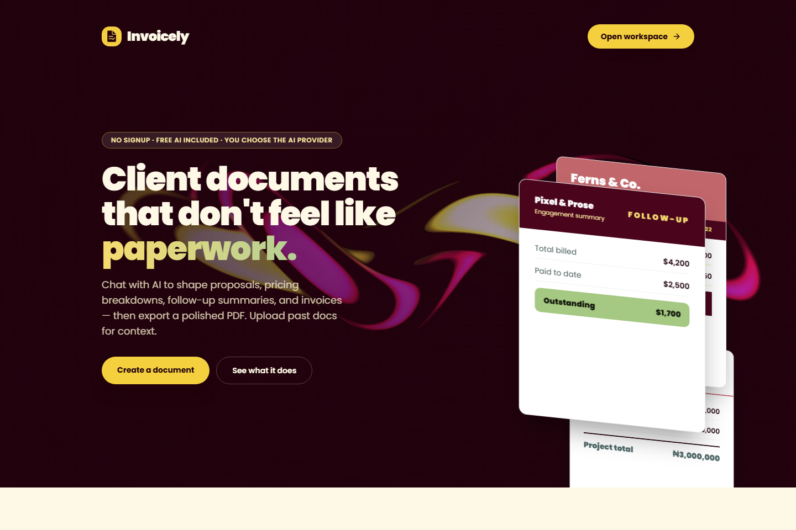
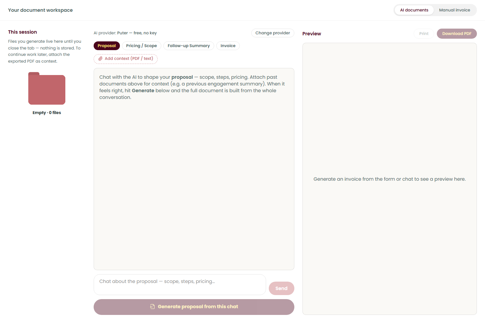
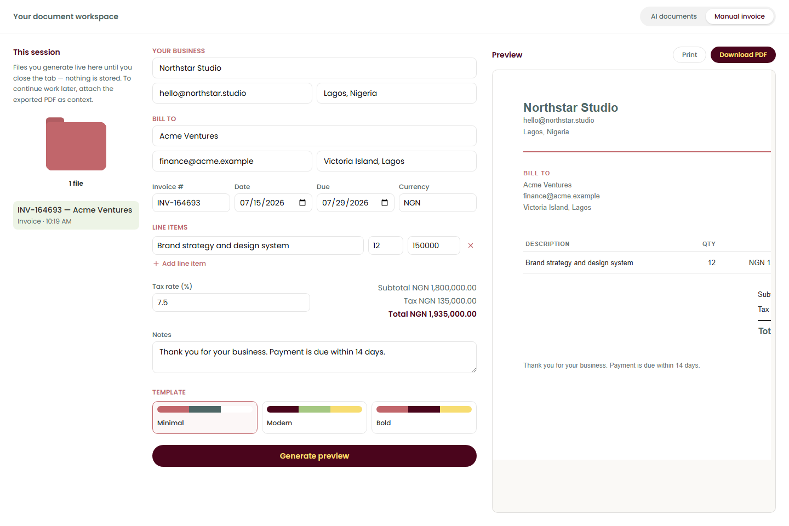

# Invoicely

> Turn a conversation—or a simple form—into polished proposals, pricing documents, follow-up summaries, and invoices.

Invoicely is a browser-first document studio for freelancers and small agencies. It combines an AI-guided workspace, reference-document context, manual invoice controls, live previews, and PDF export in one focused interface. No account or database is required.



## What you can create

| Document | Best for |
| --- | --- |
| Proposals | Turning a brief into scope, deliverables, phases, and pricing |
| Pricing / scope documents | Breaking work into itemized steps, status, and cost |
| Follow-up summaries | Consolidating progress, payments, and outstanding balances |
| Invoices | Producing client-ready bills with line items, tax, and due dates |

## Two ways to work

### Shape a document with AI

Choose a document type, talk through the engagement, optionally attach previous PDFs or text files, and generate the final document from the complete conversation. The left-hand session folder keeps every generated result available until the tab closes.



The AI workspace includes:

- Conversational scope and pricing refinement
- Focused follow-up questions when important information is missing
- PDF, TXT, Markdown, and CSV reference context
- Proposal, pricing/scope, follow-up, and invoice modes
- A live, sandboxed document preview
- Print and direct PDF export
- A session folder for switching between generated documents

### Build an invoice manually

Use the structured form when you already know the exact client, line items, rates, currency, tax, and due date. Choose from Minimal, Modern, or Bold templates and see the generated invoice beside the form.



## Highlights

- **No signup:** open the workspace and start immediately.
- **Bring your preferred model:** supports Puter, Pollinations, OpenAI, Anthropic, Google Gemini, xAI Grok, and OpenRouter.
- **Keyless starting options:** Puter is the default, and Pollinations is also available without a key.
- **Context-aware writing:** reuse details from prior documents instead of rebuilding project history manually.
- **Print-ready output:** generated documents use self-contained HTML and purpose-built print styles.
- **Safer rendering:** AI output is sanitized and displayed in a sandboxed preview before export.
- **Session-focused storage:** generated documents remain in memory rather than being uploaded to an application database.
- **Responsive workspace:** the session folder, editor/chat, and preview form a three-pane desktop workflow and stack on smaller screens.

## How it works

1. Select **AI documents** or **Manual invoice**.
2. For AI documents, choose a document type and describe the work in chat.
3. Attach relevant PDFs or text files when the model needs previous scope, payment, or project context.
4. Generate the document and review it in the preview pane.
5. Reopen versions from the session folder, then print or download the result as a PDF.

## AI providers

Open **Change provider** in the workspace to select a provider and model.

| Provider | API key | Request path |
| --- | --- | --- |
| Puter | Not required | Runs through the Puter browser SDK |
| Pollinations | Not required | Relayed by `/api/generate` |
| OpenAI | Required | Relayed by `/api/generate` |
| Anthropic | Required | Relayed by `/api/generate` |
| Google Gemini | Required | Relayed by `/api/generate` |
| xAI Grok | Required | Relayed by `/api/generate` |
| OpenRouter | Required | Relayed by `/api/generate` |

Provider keys are kept in memory for the current tab and are not persisted to `localStorage`. Refreshing or closing the page means the key must be entered again.

## Privacy and data flow

Invoicely does not require an account and does not store generated documents in an application database.

- Generated documents and chat history live in the current browser session.
- The business profile is saved locally in the browser for convenience.
- API keys are memory-only and relayed per request when a server-backed provider is selected.
- Prompts, conversation history, and extracted attachment text are sent to the selected AI provider.
- Puter requests go from the browser to Puter; the other supported providers use the stateless `/api/generate` relay.
- The relay applies body-size limits, schema validation, origin checks, timeouts, and basic per-instance rate limiting.

Do not attach information you are not permitted to share with the selected AI provider.

## Attachment limits

- Up to 5 context files per session
- Up to 15 MB per file
- Up to 100 pages per PDF
- Text-based PDFs only; scanned documents require OCR before upload
- Extracted text is trimmed before it is added to the AI prompt

## Run locally

### Requirements

- Node.js 20.9 or newer
- npm
- A modern browser

### Development

```bash
npm install
npm run dev
```

Open [http://localhost:3000](http://localhost:3000).

No environment variables are required for the default Puter provider. Other provider credentials are entered in the workspace and remain in the browser tab only.

### Production

```bash
npm run build
npm run start
```

Set `NEXT_PUBLIC_SITE_URL` to the site's public origin so canonical and
social-sharing URLs point to the deployed domain:

```bash
NEXT_PUBLIC_SITE_URL=https://your-domain.example
```

Vercel deployments automatically fall back to the project's production URL.

## Available scripts

| Command | Purpose |
| --- | --- |
| `npm run dev` | Start the Next.js development server with Turbopack |
| `npm run build` | Create and type-check an optimized production build |
| `npm run start` | Serve the production build |
| `npm run lint` | Run ESLint across the project |

## Technology

- Next.js 16 App Router
- React 19 and TypeScript
- Tailwind CSS 4
- Vercel AI SDK with provider adapters
- PDF.js for extracting text from reference PDFs
- jsPDF and html2canvas for direct PDF export
- Zod for request and AI-response validation
- GSAP and OGL for landing-page motion

## Project structure

```text
app/
  api/generate/       Stateless AI provider relay
  page.tsx            Landing page and embedded workspace
components/
  workspace/          Chat, invoice form, session folder, and preview UI
  ui/                 Shared UI primitives
lib/
  ai/                 Prompts, providers, parsing, and response handling
  templates/          Manual invoice templates
  pdf.ts              Print and PDF export
  pdfExtract.ts       Local reference-document text extraction
  sanitizeHtml.ts     Generated-document sanitization
  storage.ts          Browser-local profile and provider preferences
public/screenshots/   Product images used in this README
```

## Current product boundaries

- Session documents are intentionally cleared when the tab closes or reloads.
- The built-in rate limiter is per application instance; a distributed deployment should use a shared rate-limit store.
- Direct PDF download relies on browser-side rasterization and may not reproduce every advanced CSS feature. The Print workflow is the fallback for those cases.
- Image-only PDFs are not OCR-processed.
